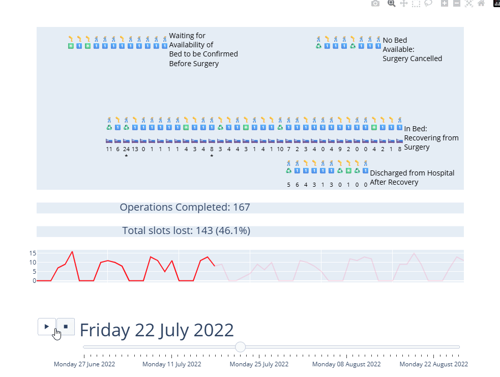

# Synchronised Traces

:::: {.columns}

::: {.column width='50%'}

:::

::: {.column width='50%'}
When going through your animation, it can be really helpful to have some additional **synchronised** plots.

In Plotly language, each layer of a plot is called a **trace**.

Historically, adding additional traces is an absolute pain - so vidigi provides some helpers to make this more achievable.
:::

::::

## What other animated plots can be handy?


```{python}
#| echo: false
#| eval: true
#| label: subplot-slide-imports
import itertools
import random
import simpy
import pandas as pd
import plotly.express as px
import plotly.graph_objects as go
import plotly.io as pio
from IPython.display import HTML

import itables
itables.init_notebook_mode(all_interactive=True)
itables.options.lengthMenu = [10]
itables.options.layout["topStart"] = None
display(HTML("<style>.dt-container { font-size: 20pt; }</style>"))

from vidigi.logging import EventLogger, TrialLogger
from vidigi.resources import VidigiStore
from vidigi.animation import (
    add_subplot_panels,
    add_synchronised_trace_from_dataframe,
    generate_animation,
)
from vidigi.prep import generate_animation_df, reshape_for_animations
from vidigi.utils import EventPosition, create_event_position_df
```


:::: {.columns}

::: {.column width='30%'}

:::

::: {.column width='70%'}

```{python}
#| echo: false
#| eval: true
#| label: gas-station-refuelling-example
"""
Gas Station Refueling example

Covers:

- Resources: Resource
- Resources: Container
- Waiting for other processes

Scenario:
  A gas station has a limited number of gas pumps that share a common
  fuel reservoir. Cars randomly arrive at the gas station, request one
  of the fuel pumps and start refueling from that reservoir.

  A gas station control process observes the gas station's fuel level
  and calls a tank truck for refueling if the station's level drops
  below a threshold.

  simpy model (simpy_gas_stations.py) written by Team SimPy as part of SimPy documentation.

"""


# fmt: off
RANDOM_SEED = 42
STATION_TANK_SIZE = 600    # MODIFIED FROM EXAMPLE: Size of the gas station tank (liters)
THRESHOLD = 25             # Station tank minimum level (% of full)
CAR_TANK_SIZE = 50         # Size of car fuel tanks (liters)
CAR_TANK_LEVEL = [5, 25]   # Min/max levels of car fuel tanks (liters)
PAYMENT_TIME = [30, 90]    # MODIFICATION: Time it takes to pay
REFUELING_SPEED = 1        # MODIFIED FROM EXAMPLE: Rate of refuelling car fuel tank (liters / second)
TANK_TRUCK_ARRIVAL_TIME = 300  # Time it takes tank truck to arrive (seconds)
TANK_TRUCK_REFUEL_TIME = 1000  # MODIFICATION: Time it takes tank truck to fill the station tank (seconds)
T_INTER = [15, 90]        # Interval between car arrivals [min, max] (seconds)
SIM_TIME = 60*60*3           # Simulation duration (seconds)
# fmt: on


def car(name, env, gas_station, station_tank, logger):
    """A car arrives at the gas station for refueling.

    It requests one of the gas station's fuel pumps and tries to get the
    desired amount of fuel from it. If the station's fuel tank is
    depleted, the car has to wait for the tank truck to arrive.

    """
    car_tank_level = random.randint(*CAR_TANK_LEVEL)
    logger.log_arrival(entity_id=name)
    # print(f"{env.now:6.1f} s: {name} arrived at gas station")
    logger.log_queue(
        entity_id=name,
        event="pump_queue_wait_begins",
        fuel_level_start=car_tank_level,
        fuel_level_end=CAR_TANK_SIZE,
    )
    with gas_station.request() as req:
        # Request one of the gas pumps
        gas_pump = yield req

        # Get the required amount of fuel
        fuel_required = CAR_TANK_SIZE - car_tank_level
        yield station_tank.get(fuel_required)

        logger.log_resource_use_start(
            entity_id=name,
            event="payment_begins",
            resource_id=gas_pump.id_attribute,
            fuel_level_start=car_tank_level,
            fuel_level_end=CAR_TANK_SIZE,
        )

        yield env.timeout(random.randint(*PAYMENT_TIME))

        logger.log_resource_use_end(
            entity_id=name,
            event="payment_ends",
            resource_id=gas_pump.id_attribute,
            fuel_level_start=car_tank_level,
            fuel_level_end=CAR_TANK_SIZE,
        )

        logger.log_resource_use_start(
            entity_id=name,
            event="pumping_begins",
            resource_id=gas_pump.id_attribute,
            fuel_level_start=car_tank_level,
            fuel_level_end=CAR_TANK_SIZE,
        )

        # The "actual" refueling process takes some time
        yield env.timeout(fuel_required / REFUELING_SPEED)

        logger.log_resource_use_end(
            entity_id=name,
            event="pumping_ends",
            resource_id=gas_pump.id_attribute,
            fuel_level_start=car_tank_level,
            fuel_level_end=CAR_TANK_SIZE,
        )

        # print(f"{env.now:6.1f} s: {name} refueled with {fuel_required:.1f}L")
        logger.log_departure(entity_id=name)


def gas_station_control(env, station_tank, logger):
    """Periodically check the level of the gas station tank and call the tank
    truck if the level falls below a threshold."""
    truck_call_id = 0

    while True:
        if station_tank.level / station_tank.capacity * 100 < THRESHOLD:
            # We need to call the tank truck now!
            logger.log_arrival(entity_id=f"Call {truck_call_id}")
            logger.log_queue(entity_id=f"Call {truck_call_id}", event="calling_truck")
            # print(f"{env.now:6.1f} s: Calling tank truck")
            # Wait for the tank truck to arrive and refuel the station tank
            yield env.process(tank_truck(env, station_tank, logger, truck_call_id))

            truck_call_id += 1

        yield env.timeout(120)  # Check every 120 seconds

# Modification to make refuelling a smooth, loggable process
def tank_truck(env, station_tank, logger, truck_call_id):
    """Tank truck arrives and refuels the station tank for a fixed duration."""
    yield env.timeout(TANK_TRUCK_ARRIVAL_TIME)
    logger.log_departure(entity_id=f"Call {truck_call_id}")
    logger.log_arrival(entity_id=f"Truck {truck_call_id}")
    logger.log_queue(entity_id=f"Truck {truck_call_id}", event="refuelling")

    refuel_time = TANK_TRUCK_REFUEL_TIME  # total time truck stays
    refuel_rate = 10  # L/s (or adjust based on need)
    step = 1  # seconds between each refill step

    total_refueled = 0
    elapsed = 0

    while (elapsed < refuel_time) | station_tank.level < (
        STATION_TANK_SIZE - (STATION_TANK_SIZE * 0.02)
    ):
        yield env.timeout(step)
        elapsed += step

        increment = refuel_rate * step
        space_available = station_tank.capacity - station_tank.level
        actual_increment = min(increment, space_available)

        if actual_increment > 0:
            station_tank.put(actual_increment)
            total_refueled += actual_increment

    # print(
    #     f"{env.now:6.1f} s: Truck {truck_call_id} refueled station with {total_refueled:.1f}L"
    # )
    logger.log_departure(entity_id=f"Truck {truck_call_id}")


def car_generator(env, gas_station, station_tank, logger):
    """Generate new cars that arrive at the gas station."""
    for i in itertools.count():
        yield env.timeout(random.randint(*T_INTER))
        env.process(car(f"Car {i}", env, gas_station, station_tank, logger))


def fuel_monitor(env, station_tank, logger, interval=1):
    """Logs the fuel level at regular intervals."""
    while True:
        logger.log_queue(
            entity_id="StationTank",
            event_type="fuel_level_change",
            event="fuel_level_change",
            value=station_tank.level,
        )
        yield env.timeout(interval)


# Setup and start the simulation
# print("Gas Station refuelling")
random.seed(RANDOM_SEED)

# Create environment and start processes
env = simpy.Environment()
gas_station = VidigiStore(env, num_resources=2, label="pump")
station_tank = simpy.Container(env, capacity=STATION_TANK_SIZE, init=STATION_TANK_SIZE)
logger = EventLogger(env=env)
logger.log_queue(
    entity_id="parameter",
    event_type="parameter",
    event="tank_size",
    value=STATION_TANK_SIZE,
)
env.process(gas_station_control(env, station_tank, logger))
env.process(car_generator(env, gas_station, station_tank, logger))
env.process(fuel_monitor(env, station_tank, logger))


# Execute!
env.run(until=SIM_TIME)

logger.to_csv("gas_station_log.csv")

event_log_df = pd.read_csv("gas_station_log.csv")

STEP_SNAPSHOT_MAX = 6
LIMIT_DURATION = 60 * 60 * 3
WRAP_QUEUES_AT = 3

# Define positions for animation
event_positions = create_event_position_df(
    [
        EventPosition(event="arrival", x=0, y=400, label="Entrance"),
        EventPosition(event="pump_queue_wait_begins", x=400, y=350, label="Queue"),
        EventPosition(
            event="payment_begins",
            x=340,
            y=175,
            resource="num_pumps",
            label="Pumping Gas",
        ),
        EventPosition(
            event="pumping_begins",
            x=340,
            y=175,
            resource="num_pumps",
            label="Pumping Gas",
        ),
        EventPosition(event="calling_truck", x=140, y=50, label="Calling Truck"),
        EventPosition(event="refuelling", x=340, y=50, label="Truck Filling Tank"),
        EventPosition(event="depart", x=250, y=50, label="Exit"),
    ]
)


class Params:
    def __init__(self):
        self.num_pumps = 2


icon_list = [
    "🚗",
    "🚙",
    "🚓",
    "🚗",
    "🚙",
    "🏍️",
    "🏍️",
    "🚗",
    "🚙",
    "🚑",
    "🚗",
    "🚙",
    "🛻",
    "🚗",
    "🚙",
    "🚛",
    "🚗",
    "🚙",
    "🚕",
    "🚗",
    "🚙",
    "🚒",
    "🚗",
    "🚙",
    "🚑",
]

random.shuffle(icon_list)

full_entity_df = reshape_for_animations(
    event_log=event_log_df,
    every_x_time_units=5,
    step_snapshot_max=STEP_SNAPSHOT_MAX,
    limit_duration=LIMIT_DURATION,
    debug_mode=False,
)

full_entity_df_plus_pos = generate_animation_df(
    full_entity_df=full_entity_df,
    event_position_df=event_positions,
    wrap_queues_at=WRAP_QUEUES_AT,
    step_snapshot_max=STEP_SNAPSHOT_MAX,
    gap_between_entities=150,
    gap_between_resources=180,
    gap_between_queue_rows=150,
    # gap_between_resource_rows=60,
    debug_mode=False,
    custom_entity_icon_list=icon_list,
)

def build_fuel_bar(value, max_value=50, length=10):
    """Create an ASCII bar to show fuel level."""
    try:
        if value is None or (
            isinstance(value, float) and (value != value)
        ):  # check for None or NaN
            proportion = 0
        else:
            proportion = min(max(value / max_value, 0), 1)
    except Exception:
        proportion = 0  # fallback

    filled = int(proportion * length)
    empty = length - filled
    filled_icon = "█"
    empty_icon = "░"
    return "[" + filled_icon * filled + empty_icon * empty + "]"

## Same as before, but increase the height to give space for some of it to be taken up by the bar plot later

def custom_icon_rules(row):
    icon = row.get("icon", "")
    entity_id = row.get("entity_id", "")
    event = row.get("event", "")
    fuel_level_start = row.get("fuel_level_start", None)  # Only for cars

    if "more" not in str(icon):
        if isinstance(entity_id, str):
            if "Truck" in entity_id:
                return "🚚 Truck is refilling the tank..."
            elif "Call" in entity_id:
                return "☎️ Calling Truck!"
            elif "Car" in entity_id:
                bar = ""
                if (
                    event == "arrival" or event == "pump_queue_wait_begins"
                ) and fuel_level_start is not None:
                    bar = " " + build_fuel_bar(fuel_level_start)
                    return icon + "<br>" + bar + "<br><br>"
                elif event == "payment_begins" and fuel_level_start is not None:
                    bar = " " + build_fuel_bar(fuel_level_start)
                    return icon + "<br>" + bar + "<br> Paying"
                elif event == "pumping_begins" and fuel_level_start is not None:
                    arrival_time = row["time"]
                    elapsed = max(float(row["snapshot_time"]) - float(arrival_time), 0)
                    current_fuel = min(fuel_level_start + elapsed * 1, 50)
                    bar = " " + build_fuel_bar(current_fuel)
                    return icon + "<br>" + bar + "<br> Pumping"
                elif event == "departure" or event == "pumping_ends":
                    bar = " " + build_fuel_bar(50)  # Car is full when it leaves
                    return icon + "<br>" + bar + "<br> <br>"

            else:
                return icon
    return icon


full_entity_df_plus_pos = full_entity_df_plus_pos.assign(
    icon=full_entity_df_plus_pos.apply(custom_icon_rules, axis=1)
)

fig = generate_animation(
    full_entity_df_plus_pos=full_entity_df_plus_pos.sort_values(
        ["entity_id", "snapshot_time"]
    ),
    event_position_df=event_positions,
    scenario=Params(),
    simulation_time_unit="seconds",
    plotly_height=650,
    plotly_width=850,
    override_x_max=500,
    override_y_max=750,
    entity_icon_size=18,
    gap_between_resources=180,
    display_stage_labels=False,
    # resource_opacity=1,
    resource_opacity=0,
    setup_mode=False,
    # custom_resource_icon="⛽",
    resource_icon_size=40,
    add_background_image="https://raw.githubusercontent.com/hsma-tools/vidigi/refs/heads/main/examples/example_15_gas_station_refuelling/gas_station.png",
    background_image_opacity=1,  # New parameter in 1.1.0
    overflow_text_color="white",  # New parameter in 1.1.0
    start_time="09:00:00",
    time_display_units="%H:%M:%S",
    debug_mode=False,
    frame_duration=100,
    frame_transition_duration=100,
)

fig = add_subplot_panels(
    fig,
    row_heights=[0.78, 0.22],
    subplot_titles=("", "Station Tank Fuel Level"),
    hide_new_panel_axes=False,
)

# One tank reading per animation snapshot (forward-filled between fuel_level_change events)
tank_level = (
    event_log_df.loc[
        event_log_df["event_type"] == "fuel_level_change", ["time", "value"]
    ]
    .drop_duplicates("time")
    .set_index("time")["value"]
)

station_fuel_df = pd.DataFrame(
    {"snapshot_time": sorted(full_entity_df_plus_pos["snapshot_time"].unique())}
)
station_fuel_df["fuel_level"] = (
    station_fuel_df["snapshot_time"].map(tank_level).ffill().bfill()
)


def fuel_bar(rows):
    return go.Bar(
        x=["Station Tank"],
        y=list(rows["fuel_level"]),
        marker_color="#4c78a8",
        showlegend=False,
        xaxis="x2",
        yaxis="y2",
    )


fig = add_synchronised_trace_from_dataframe(
    fig,
    station_fuel_df,
    fuel_bar,
    frame_time_col="snapshot_time",
    match="index",
    accumulate=False,
)

fig.update_yaxes(range=[0, station_fuel_df["fuel_level"].max() * 1.1], row=2, col=1)


HTML(fig.to_html(full_html=False, include_plotlyjs="cdn", auto_play=False))
```

:::

::::

## Or in a healthcare context...

:::: {.columns}

::: {.column width='30%'}
In this orthopaedic ward example,
:::

::: {.column width='70%'}
{.lightbox height="650px"}
:::

::::


## Step 1: Add a Blank Subplot to our existing animation

We've got to the poinr

```{.python code-line-style="dim:1,focus:2-3" code-line-style-preset="emphasis"}

reshaped_df = reshape_for_animations(...)
animation_df = generate_animation_df(...)
...
fig = generate_animation(...)

fig = add_subplot_panels(
    fig,
    row_heights=[0.7, 0.3],
    subplot_titles=("", "Patients waiting"),
    hide_new_panel_axes=False,
)
```

```{python}
#| eval: true
#| echo: false
#| label: make-subplots

from sample_code.g_three_step_animation_custom_priority_icons import Param, Model

import os
from pathlib import Path

PROJECT_ROOT = Path(os.environ["QUARTO_PROJECT_DIR"])

patient_iat_csv = PROJECT_ROOT / "sample_code" / "nspp_example_dataset.csv"

my_params = Param(num_nurses=2,
    patient_iat_csv=patient_iat_csv,
    num_nurses_unav=0,  # Switch off nurse obstruction for this example
    warm_up_period=0
    )

my_model = Model(my_params, replication_id=1)
my_model.run_model()

# The layout in sample_code/g_three_step_animation_custom_priority_icons.py is defined
# inside the `if __name__ == "__main__"` block, so it can't be imported.
# Keep this copy in sync with that file.
layout = create_event_position_df(
    [
        EventPosition(event="arrival", x=0, y=350, label="Entrance"),
        EventPosition(
            event="nurse_wait_begins", x=200, y=250, label="Waiting for Nurse"
        ),
        EventPosition(
            event="being_seen_by_nurse",
            x=200,
            y=150,
            label="Being Seen By Nurse",
            resource="num_nurses",
        ),
        EventPosition(event="depart", x=200, y=50, label="Exit"),
    ]
)


reshaped_df = reshape_for_animations(
    event_log=my_model.logger,
    every_x_time_units=1,
    limit_duration=my_params.sim_duration,
)

animation_df = generate_animation_df(
    full_entity_df=reshaped_df,
    event_position_df=layout,
)

def show_priority_icon(row):
    # First check this isn't a '+ y more' row
    if "more" not in row["icon"]:
        if row["patient_priority"] == 1:
            return "🚨"
        if row["patient_priority"] == 2:
            return "⚠️"
        else:
            return row["icon"]
    else:
        return row["icon"]

def add_time_in_step(row):
    # First check this isn't a '+ y more' row
    if "more" not in row["icon"]:
        return row["icon"] + "<br>" + f"{row["time_in_step"]:.0f}"
    else:
        return row["icon"]


animation_df = generate_animation_df(
    full_entity_df=reshaped_df,
    event_position_df=layout,
    gap_between_queue_rows=65,
    wrap_queues_at=15
)

animation_df["time_in_step"] = animation_df["snapshot_time"] - animation_df["time"]

animation_df = animation_df.assign(
            icon=animation_df.apply(show_priority_icon, axis=1)
        )

animation_df = animation_df.assign(
            icon=animation_df.apply(add_time_in_step, axis=1)
        )

fig = generate_animation(
    full_entity_df_plus_pos=animation_df,
    event_position_df=layout,
    scenario=my_params,
    plotly_height=600,
    plotly_width=1100,
    entity_icon_size=16,
    override_y_max=500,
    override_x_max=300
)

fig = add_subplot_panels(
    fig,
    row_heights=[0.7, 0.3],
    subplot_titles=("", "Patients waiting"),
    hide_new_panel_axes=False,
)

HTML(fig.to_html(full_html=False, include_plotlyjs="cdn", auto_play=False))
```


## Step 2: Generating a dataframe to visualise

:::: {.columns}

::: {.column width='50%'}

::: {style='font-size: 75%;'}
We next need a dataframe that vidigi can work from, with one column representing time - with the same gap between each snapshot as we've been working with so far in our animation - and one column representing the value we want to animate.

We'll use vidigi's helper function `queue_size_over_time()` output to get a dataframe of the queue sizes at each step.
:::

```{.python}
from vidigi.analysis import queue_size_over_time
queue_lengths_per_frame = queue_size_over_time(
    my_model.logger.to_dataframe(),
    every_x_time_units=1,
    event_list=["nurse_wait_begins"],
    limit_duration=my_params.sim_duration
    )
```

:::

::: {.column width='50%'}
```{python}
#| eval: true
#| echo: false
from vidigi.analysis import queue_size_over_time

queue_lengths_per_frame = queue_size_over_time(my_model.logger.to_dataframe(), every_x_time_units=1, event_list=["nurse_wait_begins"], limit_duration=my_params.sim_duration)
queue_lengths_per_frame
```
:::

::::


## Step 3: Passing this to our animation

:::: {.columns}

::: {.column width='45%'}

::: {style='font-size: 80%;'}
Now we pass this through to vidigi's `add_synchronised_trace_from_dataframe()` function.

```{python}
#| eval: true
#| echo: true

from vidigi.animation import (
    add_synchronised_trace_from_dataframe
    )
import plotly.graph_objects as go

fig = add_synchronised_trace_from_dataframe(
    fig, # 1
    queue_lengths_per_frame, # 2
    lambda rows: go.Scatter( # 3
        x=list(rows["snapshot_time"]), # 4
        y=list(rows["count"]), # 5
        mode="lines", # 6
        line_color="#4c78a8",
        showlegend=False,
        xaxis="x2", yaxis="y2", # 7
    ),
    frame_time_col="snapshot_time", # 8
    accumulate=True, # 9
)
```
:::
:::

::: {.column width='5%'}
:::

::: {.column width='50%'}
::: {style='font-size: 65%;'}

::: {.focus-list}
1. Pass in our existing figure object
2. Pass in our dataframe of queue counts
3. We now pass in a `lambda` function that iterates through each row of this dataframe. For each frame, we'll be making a plotly scatterplot.
4. We pass in the snapshot time
5. We pass in the count
6. We want lines, not disconnected points
7. We plot this on the secondary axis we created in the previous slide
8. We need to tell the main function what our time/frame column is called too
9. We tell it that each frame should also include all of the preceding frames
:::
:::
:::

::::


## Step 4: Display the finished plot

```{python}
#| eval: true
#| echo: false
HTML(fig.to_html(full_html=False, include_plotlyjs="cdn", auto_play=False))
```

```
