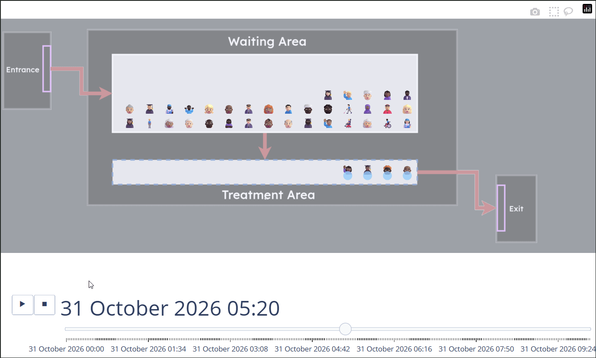
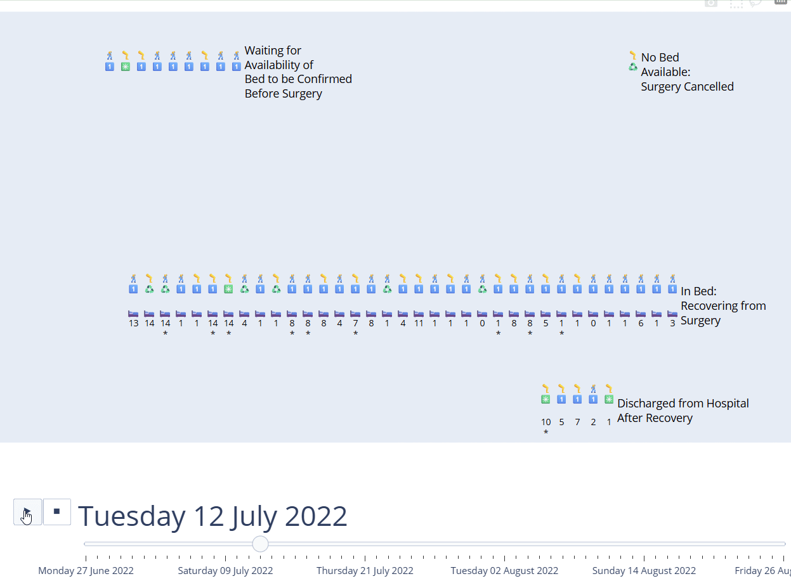
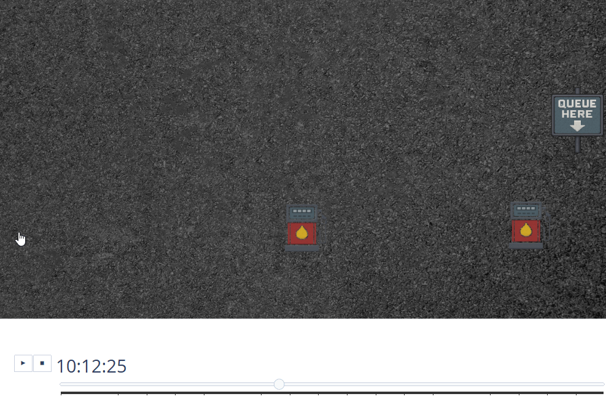
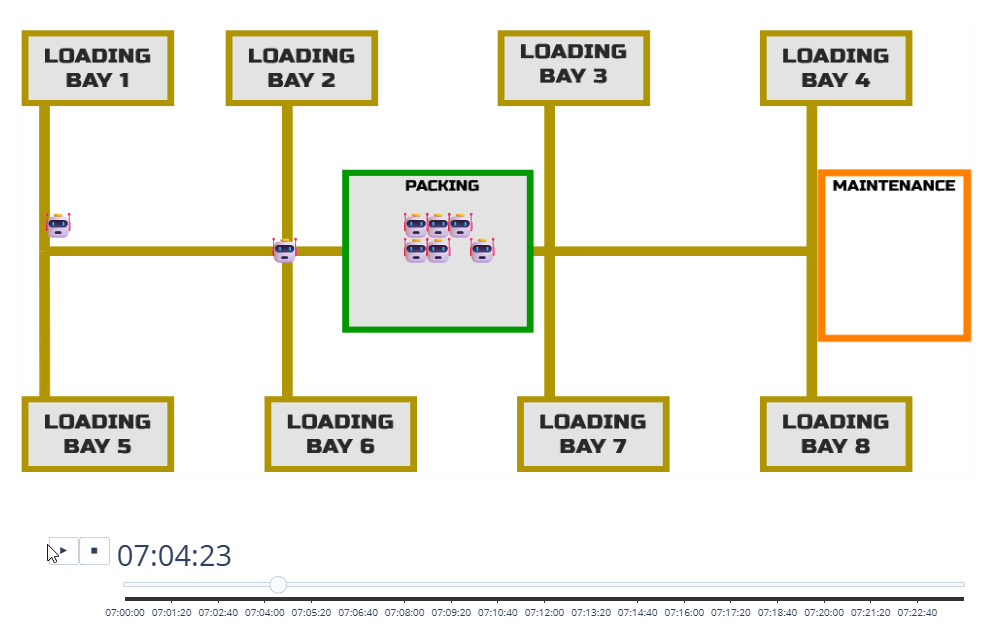
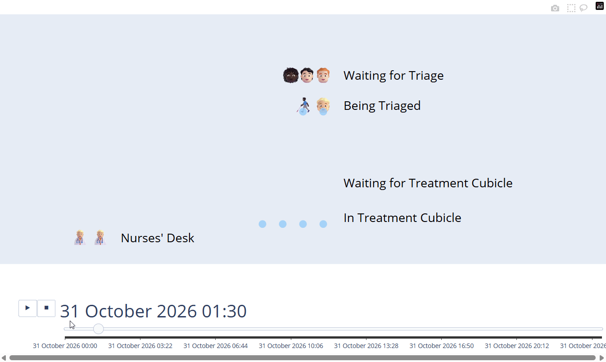

# Advanced Animations

## The big reveal...

:::: {.columns}

::: {.column width='30%'}
::: {style='font-size: 75%;'}
Vidigi's `animate_activity_log()` function that we've been using so far is actually three functions in a trenchcoat!
:::

{height=300}
:::

::: {.column width='70%'}
::: {.value-box value="reshape_for_animations()" fragment="true" icon="fa-solid fa-clock" icon-position="left"  icon-size="1.5em" padding="1rem" font-size="0.8rem" width="95%"}
This function looks over the logs and creates a minute-by-minute breakdown (or over whatever time interval you specify) of where everyone currently in the system is at that moment in time.
:::

::: {.value-box value="generate_animation_df()" icon="fa-solid fa-route" fragment="true" icon-position="left" icon-size="1.5em" padding="1rem" font-size="0.8rem" width="95%"}
This function assigns everyone their consistent icon that they will have throughout the animation

It also works out their physical position in the animation at each time point, assigning them coordinates that match their position in a queue or the resource they are using
:::

::: {.value-box value="generate_animation()" icon="fa-solid fa-clapperboard" fragment="true" icon-position="left"  icon-size="1.5em" padding="1rem" font-size="0.8rem" width="95%"}
This is the final step that calls on Plotly to turn it into an animation
:::
:::

::::


## Why bother?

Vidigi's three step process allows us to poke our nose in part way through and *modify the animation logic*

Things like

::: {.focus-list}
- changing the icons of individual entities based on their properties, like priority or diagnosis
- adding extra information to patient icons that will update in each frame, like their current length of stay
- custom pathing
- moving resources
:::


## Example - Icons by patient priority

{height=600 .lightbox}


::: {style='font-size: 35%;'}
See the full code [in the vidigi documentation by clicking here](https://hsma-tools.github.io/vidigi/examples/example_7_simplest_case_priority_resource_storewrapper/ex_7_simplest_case_priority_resource.html).
:::

## Example - Adding patient waits or LOS

{height=600 .lightbox}

::: {style='font-size: 35%;'}
See the full code [in the vidigi documentation by clicking here](https://hsma-tools.github.io/vidigi/examples/example_13_additional_synchronised_traces_method_1/synchronised_traces.html).
:::

## Example - More custom info

{height=600 .lightbox}

::: {style='font-size: 35%;'}
See the full code [in the vidigi documentation by clicking here](https://hsma-tools.github.io/vidigi/examples/example_15_gas_station_refuelling/gas_station.html).
:::

## Example - Custom pathing

{height=600 .lightbox}

::: {style='font-size: 35%;'}
See the full code [in the vidigi documentation by clicking here](https://hsma-tools.github.io/vidigi/examples/example_16_packing_robot/packing_robot.html).
:::

## Example - moving resources

{height=600 .lightbox}

::: {style='font-size: 35%;'}
See the full code [in the vidigi documentation by clicking here](https://hsma-tools.github.io/vidigi/examples/example_19_moving_resource/moving_resource.html).
:::

## Switching our code to the three-step - imports

We replace our original animation import


```{.python}
from vidigi.animation import animate_activity_log
```

With three separate imports - two from the `prep` module, and one from the `animation` module.

::: {.codewindow .python}
f_three_step_animation.py
```{.python}
from vidigi.prep import reshape_for_animations, generate_animation_df  # NEW
from vidigi.animation import generate_animation  # UPDATED
```
:::

## Updating our `Animation` class

We take our original code:

```{.python}
def build_animation(self, time_interval=1):
    return animate_activity_log(
        event_log=self.event_log, event_position_df=self.layout,
        every_x_time_units=time_interval, scenario=self.params,
    )
```
:::

::: {.fragment}

And first, we build our dataframe that is the snapshots of the minute-by-minute (or whatever time interval we choose).

::: {.codewindow .python}
f_three_step_animation.py
```{.python}
def build_animation(self, time_interval=1):
    reshaped_df = reshape_for_animations(
        event_log=self.event_log,
        every_x_time_units=time_interval,
        limit_duration=self.params.sim_duration,
    )
```
:::
:::

## Next we add in the icons and positions with `.generate_animation_df()`

::: {.codewindow .python}
f_three_step_animation.py
```{.python code-line-style="dim:1-3,focus:4-7" code-line-style-preset="emphasis"}
def build_animation(self, time_interval=1):
    reshaped_df = reshape_for_animations(...)

    animation_df = generate_animation_df(
        full_entity_df=reshaped_df,
        event_position_df=self.layout,
    )
```
:::

## And finally `.generate_animation()`

::: {.codewindow .python}
f_three_step_animation.py
```{.python code-line-style="dim:1-4,focus:5-9" code-line-style-preset="emphasis"}
def build_animation(self, time_interval=1):
    reshaped_df = reshape_for_animations(...)
    animation_df = generate_animation_df(...)

    return generate_animation(
            full_entity_df_plus_pos=animation_df,
            event_position_df=self.layout,
            scenario=self.params,
        )
```
:::

## The full before and after

:::: {.columns}

::: {.column width='45%'}

#### Before

::: {style='font-size: 85%;'}
```{.python}
def build_animation(self, time_interval=1):
    return animate_activity_log(
        event_log=self.event_log,
        event_position_df=self.layout,
        every_x_time_units=time_interval,
        scenario=self.params,
    )
```
:::
:::

::: {.column width='55%'}

#### After

::: {style='font-size: 85%;'}
::: {.codewindow .python}
f_three_step_animation.py
```{.python}
def build_animation(self, time_interval=1):
    reshaped_df = reshape_for_animations(
        event_log=self.event_log,
        every_x_time_units=time_interval,
        limit_duration=self.params.sim_duration,
    )

    animation_df = generate_animation_df(
        full_entity_df=reshaped_df,
        event_position_df=self.layout,
    )

    return generate_animation(
        full_entity_df_plus_pos=animation_df,
        event_position_df=self.layout,
        scenario=self.params,
    )
```
:::
:::
:::

::::


## A note

<div style="display: flex; justify-content: center; align-items: center;">

::: {.value-box icon="fa-solid fa-triangle-exclamation" icon-position="left" align="center" color="bg-amber"}
When you are using the three step animation, some customisation parameters need to be applied in **multiple steps**.

Others only need to be applied in a single step.

Carefully check the parameters each step accepts to avoid weird behaviour creeping in.
:::

</div>
