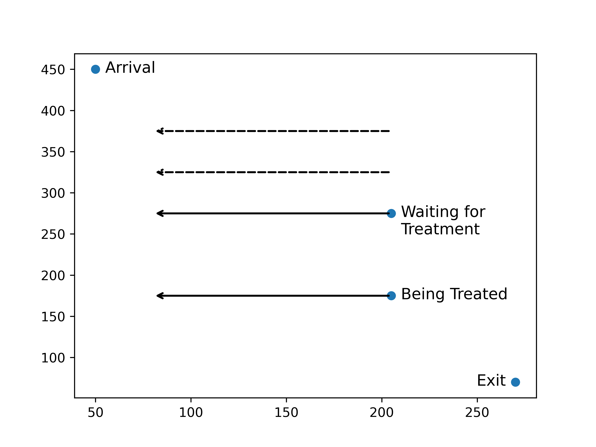
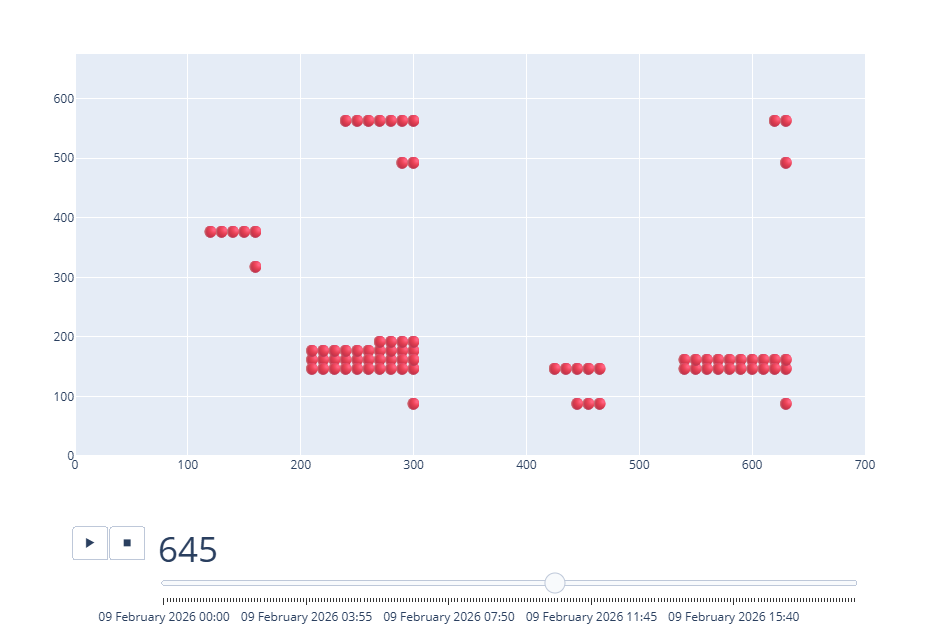
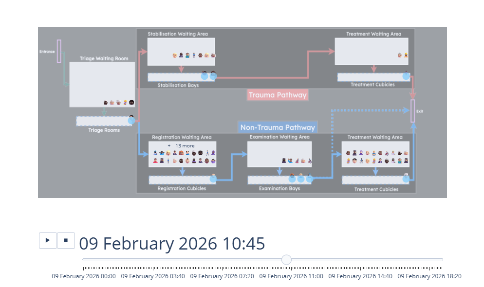

# Your First Vidigi Animation - a Walkthrough

## New Imports

First, we need a few new imports at the top of our file.

::: {.codewindow .python style="width:100%;"}
b_simple_one_step_model_vidigi.py
```{.python code-line-style="dim:1-3,focus:4-5" code-line-style-preset="emphasis"}
import simpy
from sim_tools.distributions import Exponential, Lognormal
import pandas as pd
from vidigi.logging import EventLogger  # NEW
from vidigi.utils import create_event_position_df, EventPosition  # NEW
```
:::

## Adding a Logging Class

The first thing we need to do is set up our logging class.

We will add this when initialising our `Model` class.

::: {.codewindow .python}
b_simple_one_step_model_vidigi.py
```{.python code-line-style="focus:1-2,dim:3-15,focus:16" code-line-style-preset="emphasis"}
class Model:
    def __init__(self, param):
        self.param = param
        self.env = simpy.Environment()
        self.patient_counter = 0
        self.nurse = simpy.Resource(self.env, capacity=self.param.num_nurses)
        self.patient_inter_dist = Exponential(mean=self.param.mean_patient_inter)
        self.nurse_consult_time_dist = Lognormal(
            mean=self.param.mean_nurse_consult_time,
            stdev=self.param.sd_nurse_consult_time,
        )
        self.list_of_patients = []
        self.mean_q_time_nurse = pd.NA
        self.sd_q_time_nurse = pd.NA
        self.perc_90_q_time_nurse = pd.NA
        self.logger = EventLogger(env=self.env)  # NEW
```
:::

## Adding Logging Steps - Arrivals

We can now access our logger where we need it by calling `self.logger`.

We will place all of the logging steps in the `.attend_clinic()` method.

Let's first add an arrival logging step!

::: {.codewindow .python style="width:90%;"}
b_simple_one_step_model_vidigi.py
```{.python code-line-style="focus:2" code-line-style-preset="emphasis"}
def attend_clinic(self, patient):
    self.logger.log_arrival(entity_id=patient.id)  # NEW
```
:::

::: {style='font-size: 80%;'}
Because we already gave our logger access to the SimPy env, it handles recording the time the event happened! So the only parameter we need to give our logger is an identifier for this patient, which they already record.

:::


## Adding Logging Steps - Queuing

We now record a **queuing** step with `.log_queue()`

This time, we also need to decide on a name for our event. This can be anything we like, though it's good practice to use `snake_case` (i.e. lowercase with underscores instead of spaces).

::: {.codewindow .python}
b_simple_one_step_model_vidigi.py
```{.python code-line-style="dim:2-5,focus:6,dim:7-11" code-line-style-preset="emphasis"}
def attend_clinic(self, patient):
    self.logger.log_arrival(entity_id=patient.id)

    start_q_nurse = self.env.now

    self.logger.log_queue(entity_id=patient.id, event="nurse_wait_begins")  # NEW

    with self.nurse.request() as req:
        yield req
        end_q_nurse = self.env.now
        ...
```
:::

## The simple way to record activity use

We're going to start with the simplest way of logging that someone is being seen by the nurse - also treating it as a `queue` in vidigi's language.

::: {.codewindow .python}
b_simple_one_step_model_vidigi.py
```{.python code-line-style="dim:1-5,focus:6,dim:7-10,focus:11" code-line-style-preset="emphasis"}
def attend_clinic(self, patient):
    ...
    with self.nurse.request() as req:
        yield req
        end_q_nurse = self.env.now
        self.logger.log_queue(entity_id=patient.id, event="being_seen_by_nurse")  # NEW
        patient.q_time_nurse = end_q_nurse - start_q_nurse

        sampled_nurse_act_time = self.nurse_consult_time_dist.sample()
        yield self.env.timeout(sampled_nurse_act_time)
        self.logger.log_queue(entity_id=patient.id, event="nurse_treatment_ends")  # NEW
```
:::

## But it's not a queue?!

Later, we'll look at vidigi's more advanced ways of tracking resource use, but treating it as a 'queue' step for now allows us to get a simple animation up and running very quickly.

## Adding Logging Steps - Departure

Finally, every patient needs **one** departure event.

::: {.codewindow .python}
b_simple_one_step_model_vidigi.py
```{.python code-line-style="dim:2,focus:3" code-line-style-preset="emphasis"}
def attend_clinic(self, patient):
    ...
    self.logger.log_departure(entity_id=patient.id)  # NEW
```
:::

<br>

::: {.value-box icon="fa-solid fa-triangle-exclamation" icon-position="left" color="bg-red"}
It's important that each patient only has **one** arrival and **one** departure event per model run.

Things get messy if they don't!

(So if there's any way they can 'leave and come back' in your model, think carefully about how you'll handle it...)
:::


## All the logging steps

Let's recap the changes we made.

::: {.codewindow .python}
b_simple_one_step_model_vidigi.py
```{.python code-line-style="dim:1,focus:2,dim:3-5,focus:6,dim:7-10,focus:11,dim:12-15,focus:16,dim:17,focus:18" code-line-style-preset="emphasis"}
def attend_clinic(self, patient):
    self.logger.log_arrival(entity_id=patient.id)  # NEW

    start_q_nurse = self.env.now

    self.logger.log_queue(entity_id=patient.id, event="nurse_wait_begins")  # NEW

    with self.nurse.request() as req:
        yield req
        end_q_nurse = self.env.now
        self.logger.log_queue(entity_id=patient.id, event="being_seen_by_nurse")  # NEW
        patient.q_time_nurse = end_q_nurse - start_q_nurse

        sampled_nurse_act_time = self.nurse_consult_time_dist.sample()
        yield self.env.timeout(sampled_nurse_act_time)
        self.logger.log_queue(entity_id=patient.id, event="nurse_treatment_ends")  # NEW

    self.logger.log_departure(entity_id=patient.id)  # NEW
```
:::

## Accessing our event log

Once our model has run, our `EventLogger` is sitting on our model as `my_model.logger`.

We'll want to look at the event log as a pandas dataframe, so we ask the logger to convert it for us with `to_dataframe()`.

::: {.codewindow .python}
b_simple_one_step_model_vidigi.py
```{.python code-line-style="dim:1-5,focus:6" code-line-style-preset="emphasis"}
my_params = Param()
my_model = Model(my_params)
my_model.run_model()
...

print(my_model.logger.to_dataframe().head(10))
```
:::

Vidigi's `to_dataframe()` method will look at the EventLogger object, find where it stores the event logs, and convert it into this format for us.

## Where does the animation code go?

Our models contain some key classes: `Params`, `Patient`, `Model`

(also `Trial`, but in this first example, we're just working at the level of a single model - we'll look at wiring Vidigi into `Trial` a bit later)

This time, we **don't** need a new class. Vidigi's animation function can be called directly, so our animation code goes at the bottom of our script, after our model has run.

::: {.codewindow .python}
b_simple_one_step_model_vidigi.py
```{.python code-line-style="dim:1-4,focus:5" code-line-style-preset="emphasis"}
my_params = Param()
my_model = Model(my_params)
my_model.run_model()
...
# Our animation code goes here!
```
:::

## Setting up a Layout Grid

The first thing we need for our animation is a layout grid.

:::: {.columns}

::: {.column width='40%'}
::: {.codewindow .python}
b_simple_one_step_model_vidigi.py
```{.python}
EventPosition(
    event="nurse_wait_begins",
    x=200,
    y=250,
    label="Waiting for Nurse"
    )
```
:::
:::

::: {.column width='5%'}
:::

::: {.column width='55%'}
::: {style="font-size: 75%;"}

For each event we want in our animation, we create an `EventPosition` object and pass four things:

- the event name [(which **MUST** match what we called it in the logger)]{style="color:yellow"}
- an x coordinate for the [**front**]{style="color:yellow"} of that queue
- a y coordinate for the [**front**]{style="color:yellow"} of that queue
- a nicer label for the event to display in the animation

:::
:::

::::


## Queuing direction

:::: {.columns}

::: {.column width='70%'}
{height=600}
:::

::: {.column width='30%'}
::: {style='font-size: 75%;'}
In this example,

- Arrival is at x=50, y=450
- Waiting for treatment is at x=200, y=275
- Being treated is at x=200, y=175
- Exit is at x=275, y=25

Dotted lines show where the queue would wrap

:::

:::

::::


## Coordinates
::: {style='font-size: 70%;'}
Vidigi works out the position of every entity and resource based on those few positions you define
:::

::: {.r-stack}
{.lightbox height=600}

{.fragment .lightbox height=600}
:::

## Placing Arrival and Departure Events

Behind the scenes, EventLogger always gives these the same event name if you use `.log_arrival()` and `.log_departure()`.

:::: {.columns}

::: {.column width='45%'}
`.log_arrival()` = "arrival"

::: {.codewindow .python style="width:100%;"}
b_simple_one_step_model_vidigi.py
```{.python}
EventPosition(
    event="arrival",
    x=0, y=350,
    label="Entrance"
)
```
:::
:::

::: {.column width='10%'}
:::

::: {.column width='45%'}
`.log_departure()` = "depart"

::: {.codewindow .python style="width:100%;"}
b_simple_one_step_model_vidigi.py
```{.python}
EventPosition(
    event="depart",
    x=200, y=50,
    label="Exit"
)
```
:::
:::

::::


<br>


## `create_event_position_df`

::: {style="font-size: 65%;"}

We pass a `list` of all our EventPosition objects to the function `create_event_position_df`.
Remember - a Python list uses `[]` with each item separated by a `,`
:::

::: {.codewindow .python}
b_simple_one_step_model_vidigi.py
```{.python}
create_event_position_df(
    [
        EventPosition(
            event="arrival", x=0, y=350, label="Entrance"
        ),
        EventPosition(
            event="nurse_wait_begins", x=200, y=250, label="Waiting for Nurse"
        ),
        EventPosition(
            event="being_seen_by_nurse", x=200, y=150, label="Being Seen By Nurse"
        ),
        EventPosition(
            event="depart", x=200, y=50, label="Exit"
        )
    ]
)
```
:::

::: {style="font-size: 65%;"}
::: {.fragment}
We don't need to visualise the 'nurse_treatment_ends' step as the timing will be identical to the depart step.
:::
:::


## The full Grid in situ

We'll store this in a variable called `layout`, at the bottom of our script.

::: {.codewindow .python}
b_simple_one_step_model_vidigi.py
```{.python code-line-style="dim:1-2,focus:3-18" code-line-style-preset="emphasis"}
...

layout = create_event_position_df(
    [
        EventPosition(
            event="arrival", x=0, y=350, label="Entrance"
        ),
        EventPosition(
            event="nurse_wait_begins", x=200, y=250, label="Waiting for Nurse"
        ),
        EventPosition(
            event="being_seen_by_nurse", x=200, y=150, label="Being Seen By Nurse"
        ),
        EventPosition(
            event="depart", x=200, y=50, label="Exit"
        )
    ]
)
```
:::

## Generating the Animation

Now, we just need to ask our logger to generate the animation for us, using vidigi's `animate_activity_log()`.

We pass it our layout, and how often we want a frame in our animation - here, one frame for every 1 minute of simulated time.

::: {.codewindow .python}
b_simple_one_step_model_vidigi.py
```{.python code-line-style="dim:1-3,focus:4-7,dim:8,focus:9" code-line-style-preset="emphasis"}
...
layout = create_event_position_df(...)

fig = my_model.logger.animate_activity_log(
    event_position_df=layout,
    every_x_time_units=1,
)

fig.show()
```
:::

## The event log

```{python}
#| eval: true
#| echo: false
#| label: output-simple-event-log

import itables
import pandas as pd
from IPython.display import HTML
itables.init_notebook_mode(all_interactive=True)
itables.options.lengthMenu = [10]
itables.options.layout["topStart"] = None

display(HTML("<style>.dt-container { font-size: 20pt; }</style>"))

from sample_code.b_simple_one_step_model_vidigi import Param, Model
from vidigi.utils import create_event_position_df, EventPosition

my_params = Param()
my_model = Model(my_params)
my_model.run_model()

my_model.logger.to_dataframe()
```


## The animation

```{python}
#| eval: true
#| echo: false
#| label: first-simple-animation

# Layout is defined inside the `if __name__ == "__main__":` block of
# b_simple_one_step_model_vidigi.py, so it can't be imported - keep this
# copy in sync with that file
layout = create_event_position_df(
    [
        EventPosition(event="arrival", x=0, y=350, label="Entrance"),
        EventPosition(
            event="nurse_wait_begins", x=200, y=250, label="Waiting for Nurse"
        ),
        EventPosition(
            event="being_seen_by_nurse", x=200, y=150, label="Being Seen By Nurse"
        ),
        EventPosition(event="depart", x=200, y=50, label="Exit"),
    ]
)

fig = my_model.logger.animate_activity_log(
    event_position_df=layout,
    every_x_time_units=1,
    plotly_height=600,
    plotly_width=1180
)

HTML(fig.to_html(full_html=False, include_plotlyjs="cdn", auto_play=False))
```
