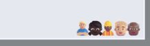
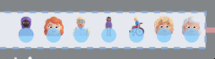
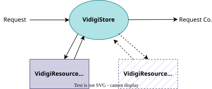

# Advanced Vidigi Elements: Resources

## Why is Resource Use Different to Queues?

:::: {.columns}

::: {.column width='50%'}
So far, we've used a **queue** for resource use
:::

::: {.column width='50%'}
{.lightbox}
:::

::::

And this works, but has a couple of downsides...

::: {.focus-list}
- People move through the resource use step like a queue rather than staying with a single resource
- You can't see resources that **aren't** being used, so it's difficult to tell whether the system is underutilising resources
:::

::: {.fragment}
(you can usually tell if it's *over* capacity because a queue will be building up!)
:::

::: {.fragment}

:::: {.columns}

::: {.column width='50%'}
Resource use allows us to fix this
:::

::: {.column width='50%'}
{.lightbox}
:::

::::

:::

## What do we change?

We don't have to change too much!

::: {.fragment}
1. We will swap in a *custom* resource class instead of Simpy.Resource
:::

::: {.fragment}
1. We will set up automated logging of our resource use events - vidigi captures the ID of the resource used for us
:::

::: {.fragment}
1. We will tell our layout which resource to draw, and pass our params to our animation code (so it knows how many resources there are)
:::

## Custom Resource Classes

Vidigi provides two key custom resource classes

:::: {.columns}

::: {.column width='50%'}
::: {.value-box align="center" value="VidigiStore"}
Equivalent to `simpy.Resource`
:::
:::

::: {.column width='50%'}
::: {.value-box align="center" value="VidigiPriorityStore"}
Equivalent to `simpy.PriorityResource`
:::
:::

::::

::: {.value-box icon="fa-solid fa-triangle-exclamation" icon-position="left" color="bg-red" fragment="fade-in"}
We don't want to use *VidigiResource*.

This is a special class that Vidigi uses internally, and by itself it won't allow us to track the resource
ID in the way we need to.
:::

## Why do we need these?

Let's imagine we have two nurses.

SimPy resources don't *really* have a concept of separate nurses behind the scenes.

## The VidigiStore approach

In contrast, a VidigiStore is filled with individual nurses, each with their own ID.

If vidigi knows the ID of a resource, it ensures that people are assigned to the right resource in the animation for the whole time they are using it.
