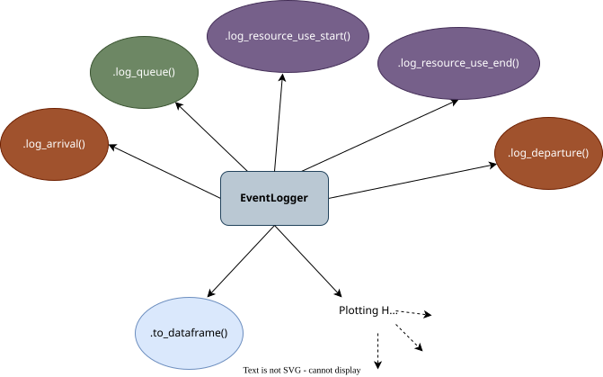

# Key Parts of Vidigi

## What do you need?

:::: {.value-box-row icon-position="top" align="center"}

::: {.value-box value="Step 1" icon="fa-solid fa-clipboard" fragment="true"}
Add logging steps for arrivals, queues, resource use, and departures
:::

::: {.value-box value="Step 2" icon="fa-solid fa-table-cells" fragment="true"}
Set up a coordinate grid
:::

::: {.value-box value="Step 3" icon="fa-solid fa-clapperboard" fragment="true"}
Set your animation parameters and generate your animation
:::

::::


## EventLogger

Vidigi's `EventLogger` class is the powerhouse of the whole shebang.

It allows us to record the key types of events that happen throughout the model.


## Using EventLogger

We can import EventLogger from the `utils` module of vidigi like this.

```python
from vidigi.utils import EventLogger
```


::: {.fragment}

We then set up an instance of EventLogger like so.

```python
my_logger = EventLogger(env=my_simpy_env)
```

I'll talk about *where* we do that in our model a bit later.

:::


::: {.fragment}

Then we record different events like this.

```python
my_logger.log_queue()
```

:::


## EventLogger's Logging Types

<div style="display: flex; justify-content: center; align-items: center; height: 80vh">



</div>

## Why EventLogger?

:::{.value-box-row height="400px" align="center"}

::: {.value-box value="The Format Vidigi Expects"}
<br> The EventLogger methods work with all of vidigi's defaults, making it less likely that you'll make errors when adding an animation in
:::

::: {.value-box value="Extra Plotting Helpers" fragment="fade-in"}
<br> Later, we'll see other plots - not just animations - that EventLogger can automate for us
:::

:::
