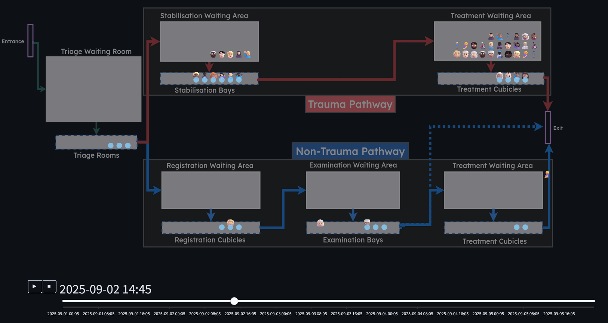

# Introduction

## If a picture is worth a thousand words...

::: {.fragment}

... then an animation might be worth a lot more!

:::

## Benefits of animations

::::{.value-box-row}

::: {.value-box icon="fa-solid fa-lightbulb" fragment="fade-in" align="center"}
Helps non-technical users understand what's going on
:::

::: {.value-box icon="fa-solid fa-bullhorn" fragment="fade-in" align="center"}
Helps get people excited about your model
:::

::: {.value-box icon="fa-solid fa-bug" fragment="fade-in" align="center"}
Helps with debugging
:::

::::
