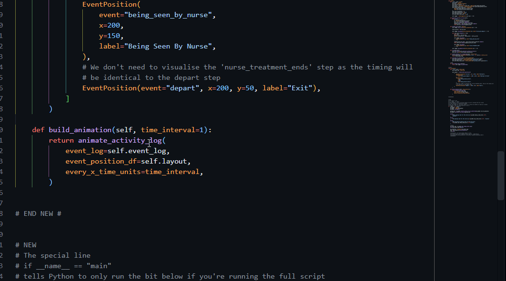

# Additional customisation for your vidigi animations

## Why customise?

::: {.focus-list}
- Vidigi animations often require a little bit of tweaking to look their best
- Other parameters can help you find a balance between the granularity of the animation and the time it takes to regenerate
:::


## How do I know what I can customise?

::: {style='font-size: 75%;'}
We will go through some details of key parameters here now, but there are two other ways you may want to explore yourself.
:::

:::: {.columns}

::: {.column width='50%'}

::: {style='font-size: 75%;'}
### API Documentation
Many packages - vidigi included - will have documentation that will tell you every parameter that can be changed.
Vidigi's is at [hsma-tools.github.io/vidigi/reference/](https://hsma-tools.github.io/vidigi/reference/).
:::

{.lightbox}

:::

::: {.column width='50%'}


::: {.fragment}

::: {style='font-size: 75%;'}
### The docstring
When you write code, hovering over a class or function will - if the author has included a special comment called a **docstring** - display every editable **parameter** and its default value. Scroll down and you will find a more detailed description of what the parameter is.
:::

{.lightbox}

:::


:::

::::


## Time Interval

For this, vidigi thinks in time 'units'.

If your model is set up in minutes, 1 unit = 1 minute

If it's set in weeks, 1 unit = 1 week

```{.python code-line-style="focus:1,dim:2-3,focus:4,dim:5" code-line-style-preset="emphasis"}
animate_activity_log(
    event_log=event_log,
    event_position_df=layout,
    every_x_time_units=1,
)
```

::: {style='font-size: 75%;'}
<br>
:::

<div style="display: flex; justify-content: center; align-items: center;">

::: {.value-box fragment="fade-in" icon="fa-solid fa-lightbulb" icon-position="left" align="center" color="bg-green" width="95%"}
**Why not always just use a time unit of 1?**

The time interval has a big impact on the time it takes for an animation to generate.

It directly influences how big the underlying dataframe is, as well as the number of frames of animation data that need to be stored.
:::

</div>


## Every 1 minute

```{python}
#| eval: true
#| echo: false
#| label: every-1-min-time-size

from sample_code.c_simple_one_step_model_vidigi_resources import Param, Model, Animation
from vidigi.animation import animate_activity_log
import time


my_params = Param(sim_duration=60*24)
my_model = Model(my_params)
my_model.run_model()

my_event_log = my_model.get_vidigi_event_log()
my_animation = Animation(my_event_log, my_params)

# Time the animation generation
start_time_1 = time.perf_counter()

fig = animate_activity_log(
    event_log=my_animation.event_log,
    event_position_df=my_animation.layout,
    scenario=my_params,
    every_x_time_units=1,
    plotly_height=600,
    plotly_width=1100
)

animation_time_1 = time.perf_counter() - start_time_1

html_fig_1 = fig.to_html(full_html=False, include_plotlyjs="cdn", auto_play=False)

size_kb_1 = len(html_fig_1.encode("utf-8")) / 1024

HTML(html_fig_1)
```


## Every 10 minutes

```{python}
#| eval: true
#| echo: false
#| label: every-10-mins-time-size
start_time_2 = time.perf_counter()

fig = animate_activity_log(
    event_log=my_animation.event_log,
    event_position_df=my_animation.layout,
    every_x_time_units=10,
    plotly_height=600,
    plotly_width=1100
)

animation_time_2 = time.perf_counter() - start_time_2

html_fig_2 = fig.to_html(full_html=False, include_plotlyjs="cdn", auto_play=False)

size_kb_2 = len(html_fig_2.encode("utf-8")) / 1024

HTML(html_fig_2)
```


## Time Interval - A Comparison

Let's compare some figures for an animation that runs for 24 hours of a clinic.

:::: {.columns}

::: {.column width='50%'}

**Every 1 minute**

- Total frames:  `{python} f"(my_params.sim_duration / 1):.0f"`
- Time to generate:  `{python} round(animation_time_1,2)` seconds
- Animation file size:  `{python} round(size_kb_1,1)` kb  (`{python} round(size_kb_1/1000,1)` mb)

:::

::: {.column width='50%'}
**Every 10 minutes**

- Total frames:   `{python} f"(my_params.sim_duration / 10):.0f"`
- Time to generate:  `{python} round(animation_time_2,2)` seconds
- Animation file size:  `{python} round(size_kb_2,1)` kb (`{python} round(size_kb_2/1000,1)` mb)

:::

::::


## Limit Duration

Another approach you can take to reducing size is to use the `limit_duration` argument.

In a simulation you run for several days, you may choose to only show a small snippet from the start of the animation.

```{.python code-line-style="dim:1-3,focus:4,dim:5" code-line-style-preset="emphasis"}
fig = animate_activity_log(
    event_log=my_animation.event_log,
    event_position_df=my_animation.layout,
    limit_duration=500
)

```

::: {style='font-size: 75%;'}
<br>
:::

<div style="display: flex; justify-content: center; align-items: center;">

::: {.value-box fragment="fade-in" icon="fa-solid fa-lightbulb" icon-position="left" align="center" color="bg-green"}
We'll talk a bit later about how to manage warm-up when you are creating animations - and this same feature could help you show a snippet from somewhere in the middle of the animation instead of the start.
:::

</div>


## Play Speed

Vidigi has two key parameters dictating how fast your animation runs:

- `frame_duration` (default = 400ms)
- `frame_transition_duration` (default = 600ms)

## Frame Duration - 100

```{python}
#| eval: true
#| echo: false
#| label: frame-duration-demo-short

fig = animate_activity_log(
    event_log=my_animation.event_log,
    event_position_df=my_animation.layout,
    scenario=my_params,
    limit_duration=60,
    every_x_time_units=1,
    plotly_height=600,
    plotly_width=1100,
    frame_duration=100
)
HTML(fig.to_html(full_html=False, include_plotlyjs="cdn", auto_play=False))
```

## Frame Duration - 1000

```{python}
#| eval: true
#| echo: false
#| label: frame-duration-demo-long

fig = animate_activity_log(
    event_log=my_animation.event_log,
    event_position_df=my_animation.layout,
    scenario=my_params,
    limit_duration=60,
    every_x_time_units=1,
    plotly_height=600,
    plotly_width=1100,
    frame_duration=1000
)
HTML(fig.to_html(full_html=False, include_plotlyjs="cdn", auto_play=False))
```


## Frame Transition Duration - 0


```{python}
#| eval: true
#| echo: false
#| label: frame-transition-demo-short-zero

fig = animate_activity_log(
    event_log=my_animation.event_log,
    event_position_df=my_animation.layout,
    scenario=my_params,
    limit_duration=60,
    every_x_time_units=1,
    plotly_height=600,
    plotly_width=1100,
    frame_transition_duration=0
)
HTML(fig.to_html(full_html=False, include_plotlyjs="cdn", auto_play=False))
```

## Queue Wrapping

The `wrap_queues_at` parameter changes how many people appear in every row of the queue. This is useful when queues start getting very long.

```{python}
#| eval: true
#| echo: false
#| label: queue-wrapping-demo

fig = animate_activity_log(
    event_log=my_animation.event_log,
    event_position_df=my_animation.layout,
    scenario=my_params,
    limit_duration=60,
    every_x_time_units=1,
    wrap_queues_at=5,
    plotly_height=500,
    plotly_width=1100,
)
HTML(fig.to_html(full_html=False, include_plotlyjs="cdn", auto_play=False))
```

## Entity Spacing

`gap_between_entities` and `gap_between_queue_rows` reflect the horizontal and vertical space between queueing entities respectively.

```{python}
#| eval: true
#| echo: false
#| label: entity-spacing-demo

fig = animate_activity_log(
    event_log=my_animation.event_log,
    event_position_df=my_animation.layout,
    scenario=my_params,
    limit_duration=60,
    every_x_time_units=1,
    gap_between_entities=60,
    gap_between_queue_rows=60,
    plotly_height=500,
    plotly_width=1100,
)
HTML(fig.to_html(full_html=False, include_plotlyjs="cdn", auto_play=False))
```

## Entity Sizing

`entity_icon_size` affects the size of entity icons. You'll usually need to pair this with `gap_between_entities` and `gap_between_queue_rows` to get it looking right.

```{python}
#| eval: true
#| echo: false
#| label: entity-sizing-demo

fig = animate_activity_log(
    event_log=my_animation.event_log,
    event_position_df=my_animation.layout,
    scenario=my_params,
    limit_duration=60,
    every_x_time_units=1,
    gap_between_entities=30,
    entity_icon_size=60,
    plotly_height=500,
    plotly_width=1100,
)
HTML(fig.to_html(full_html=False, include_plotlyjs="cdn", auto_play=False))
```

## Resource Wrapping

Similarly to queues, when you have a large number of resources, you may want to wrap them over multiple lines.

Here we have 20 nurses, so we use `wrap_resources_at` so they don't overflow off the screen.

```{python}
#| eval: true
#| echo: false
#| label: resource-wrapping-demo

my_params = Param(sim_duration=60, num_nurses=20)
my_model = Model(my_params)
my_model.run_model()

my_event_log = my_model.get_vidigi_event_log()
my_animation = Animation(my_event_log, my_params)

fig = animate_activity_log(
    event_log=my_animation.event_log,
    event_position_df=my_animation.layout,
    scenario=my_params,
    limit_duration=60,
    every_x_time_units=1,
    wrap_resources_at=5,
    plotly_height=500,
    plotly_width=1100,
)
HTML(fig.to_html(full_html=False, include_plotlyjs="cdn", auto_play=False))
```

## Resource Spacing

`gap_between_resources` and `gap_between_resource_rows` reflect the horizontal and vertical space between rows respectively.

```{python}
#| eval: true
#| echo: false
#| label: resource-spacing-demo

my_params = Param(sim_duration=60, num_nurses=10)
my_model = Model(my_params)
my_model.run_model()

my_event_log = my_model.get_vidigi_event_log()
my_animation = Animation(my_event_log, my_params)

fig = animate_activity_log(
    event_log=my_animation.event_log,
    event_position_df=my_animation.layout,
    scenario=my_params,
    limit_duration=60,
    every_x_time_units=1,
    gap_between_resources=30,
    gap_between_resource_rows=30,
    plotly_height=500,
    plotly_width=1100,
)
HTML(fig.to_html(full_html=False, include_plotlyjs="cdn", auto_play=False))
```

## Resource Sizing

And `resource_icon_size` handles the icon size for your resources. You'll usually need to pair this with `gap_between_resources` and `gap_between_resource_rows` to get it looking right.

```{python}
#| eval: true
#| echo: false
#| label: resource-sizing-demo

fig = animate_activity_log(
    event_log=my_animation.event_log,
    event_position_df=my_animation.layout,
    scenario=my_params,
    limit_duration=60,
    every_x_time_units=1,
    gap_between_resources=30,
    gap_between_resource_rows=30,
    resource_icon_size=50,
    plotly_height=500,
    plotly_width=1100,
)
HTML(fig.to_html(full_html=False, include_plotlyjs="cdn", auto_play=False))
```

## Column name parameters (and why you can ignore them)

If you look at the docstring or docs for `animate_activity_log`, you may notice that Vidigi provides a number of parameters relating to the names of the columns in the `event_log` you provide.

:::: {.columns}

::: {.column width='50%'}
- `time_col_name` - default 'time'
- `entity_col_name` - default 'entity_id'
- `event_type_col_name` - default 'event_type'
:::

::: {.column width='50%'}
- `event_col_name` - default 'event'
- `pathway_col_name` - default None
- `resource_col_name` - default 'resource_id'
:::

::::

<div style="display: flex; justify-content: center; align-items: center">

::: {.value-box fragment="fade-in" icon="fa-solid fa-lightbulb" icon-position="left" align="center" color="bg-green"}
Good news - if you're using `EventLogger`, then you can ignore these parameters entirely!

All of the defaults for these parameters reflect the default names used by `EventLogger`.

The parameters are provided for people who wrote their model logging without the use of Vidigi and want to retrofit an animation onto it.
:::

</div>
