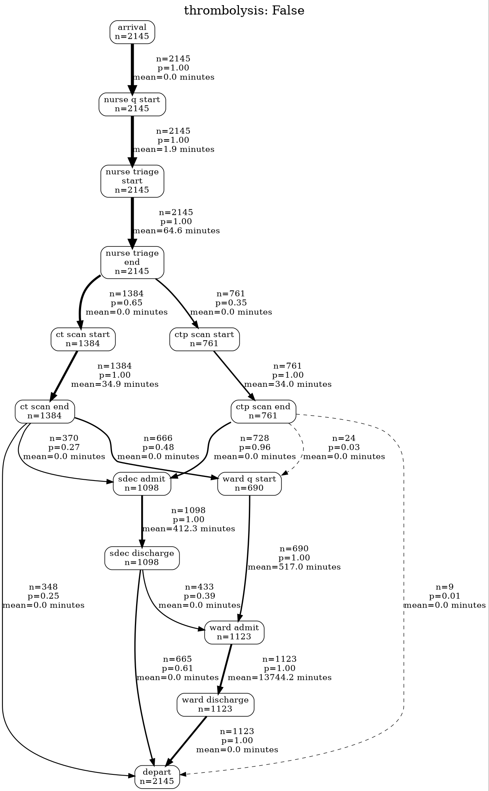

# Process Maps

## What is a process map?

There is a field of data science called **process mining** or **process analytics**.

This looks at pre-existing processes - for example, a referrals process - where **timestamped** data exists, and helps to show

- how the process *really* happens
- the time between different events in the process, highlighting delays and possible problems
- the possible routes people can take through a system, and how many people go down each route

## An example process map

:::: {.columns}

::: {.column width='30%'}
We can see an example process map here.

This is a type of graph called a [**Directly Follows Graph (DFG)**]{style="color:yellow"}
:::

::: {.column width='70%'}
{height=650 .lightbox}
:::

::::

## Past vs potential future

::: {style='font-size: 75%;'}
Now, there's no reason why we can't apply the same approach to simulated logs!

In fact, it can be extremely helpful - particularly for debugging as our simulation gets more complex and has different groups of patients who should be experiencing different events at different rates.
:::

:::: {.columns}

::: {.column width='33%'}
{height=400 .lightbox}
:::

::: {.column width='33%'}
Here, we use it to confirm that patients who are thrombolysed in our model never follow a certain path.
:::


::: {.column width='33%'}
{height=400 .lightbox}
:::


::::


## Process Mining with Vidigi

Vidigi provides various helper functions for process mining. The four key steps are as follows:

1. New imports
1. Add timestamps to our event log
1. Discover the nodes and edges of our directly follows graph [(easier than it sounds - 1 line of code!)]{style="color:lightgrey"}
1. Generate the visualisation

Afterwards, we'll see a shortcut that does steps 2-4 for us in a single call.

## Process Mining Imports

We'll add some new vidigi imports.

::: {.codewindow .python}
e_simple_one_step_model_vidigi_process_map.py
```{.python}
from vidigi.process_mapping import (
    add_sim_timestamp,
    discover_dfg,
    dfg_to_graphviz,
    dfg_to_cytoscape,
)
```
:::

And a new import that helps the resulting graph display.

::: {.codewindow .python}
e_simple_one_step_model_vidigi_process_map.py
```{.python}
from IPython.display import display
```
:::

## Adding a timestamp

Unlike vidigi animations, which just work with time 'units', the process mining side needs a more absolute representation of time, so we will convert the time in units for each event to a clock time.

First, we pull out the event log for one run from our trial logger, then pass it to `add_sim_timestamp()`.

:::: {.columns}

::: {.column width='65%'}

::: {.codewindow .python}
e_simple_one_step_model_vidigi_process_map.py
```{.python code-line-style="dim:1,focus:2,dim:3-5" code-line-style-preset="emphasis"}
my_event_log_timestamp = add_sim_timestamp(
    my_trial.trial_logger.get_log_by_run(run=1, as_df=True),
    time_unit="minutes",
    sim_start="09:00:00",
).copy()
```
:::

:::

::: {.column width='35%'}
::: {.value-box fragment="fade-in" icon="fa-solid fa-lightbulb" icon-position="top" align="center" color="bg-green" font-size="0.8rem" width="85%" icon-size="1rem"}
It doesn't *really* matter what time we use here as it won't ever be displayed in the process mining outputs. It's more about giving vidigi a reference point.

However, if time does make sense in your simulation - like you have a clinic that opens at 8am every day - then it makes sense to make that the time you pass in!
:::
:::

::::


## Adding a timestamp - Example Output

Let's take a quick look at our event log with the timestamp added.

```{python}
#| eval: true
#| echo: false
#| label: dfg-run-model-add-timestamp

import itables
import pandas as pd
from IPython.display import HTML
itables.init_notebook_mode(all_interactive=True)
itables.options.lengthMenu = [10]
itables.options.layout["topStart"] = None
display(HTML("<style>.dt-container { font-size: 20pt; }</style>"))

from sample_code.e_simple_one_step_model_vidigi_process_map import Param, Trial
from vidigi.process_mapping import (
    add_sim_timestamp,
    discover_dfg,
    dfg_to_graphviz,
    dfg_to_cytoscape,
)

my_params = Param(mean_patient_inter=3, num_nurses=2, mean_nurse_consult_time=10)
my_trial = Trial(my_params)
my_trial.run_trial()
my_trial.calculate_trial_results()

my_event_log_timestamp = add_sim_timestamp(
    my_trial.trial_logger.get_log_by_run(run=1, as_df=True),
    time_unit="minutes",
    sim_start="09:00:00",
).copy()

my_event_log_timestamp
```


## Discovering the DFG

Now we need to find our nodes and edges, which we use the `discover_dfg()` function for.

Remember: DFG = directly follows graph

::: {.codewindow .python}
e_simple_one_step_model_vidigi_process_map.py
```{.python code-line-style="dim:1-2,focus:3-9" code-line-style-preset="emphasis"}
my_event_log_timestamp = add_sim_timestamp(...)

nodes, edges = discover_dfg(
    my_event_log_timestamp,
    # Our 'case_col' will be 'entity_id' if we've used EventLogger
    # This just means that each person is considered to be a separate
    # journey
    case_col="entity_id",
)
```
:::

## Nodes

```{python}
#| eval: true
#| echo: false
#| label: discover-dfg
nodes, edges = discover_dfg(
        my_event_log_timestamp,
        # Our 'case_col' will be 'entity_id' if we've used EventLogger
        # This just means that each person is considered to be a separate
        # journey
        case_col="entity_id",
    )
```

Nodes are the steps

```{python}
#| eval: true
#| echo: false
#| label: dfg-nodes
nodes
```

## Edges

Edges are the flows between nodes

```{python}
#| eval: true
#| echo: false
#| label: dfg-edges
edges
```

## Generating the process map (DFG)

We can now take our nodes and edges to create a static process map...

:::: {.columns}

::: {.column width='95%'}
```{python}
#| eval: true
#| echo: true
#| label: dfg-static
graphviz_graph = dfg_to_graphviz(nodes, edges, min_frequency=5)
display(graphviz_graph)
```
:::

::: {.column width='5%'}

:::

::::


## Generating the process map (DFG) - interactive

... or an interactive one!

::: {style='font-size: 75%;'}
`min_frequency=5` hides any route that was taken fewer than 5 times, to keep things readable.
:::

```{.python}
cytoscape_widget = dfg_to_cytoscape(
    nodes,
    edges,
    min_frequency=5,
    layout_name="dagre",
    layout_orientation="LR",
    spacing_factor=2,
    width=1400,
)
display(cytoscape_widget)
```

```{python}
#| eval: true
#| echo: false
#| label: dfg-interactive
from IPython.display import display

cytoscape_widget = dfg_to_cytoscape(
    nodes,
    edges,
    min_frequency=5,
    layout_name="dagre",
    layout_orientation="LR",
    spacing_factor=2,
    width=1100,
    height=500,
)

display(cytoscape_widget)
```


## A shortcut - `generate_dfg()`

The `TrialLogger` (and the `EventLogger`) can do steps 2-4 in a single call - it adds the timestamps, discovers the nodes and edges and draws the graph.

::: {.codewindow .python}
e_simple_one_step_model_vidigi_process_map.py
```{.python}
display(
    my_trial.trial_logger.generate_dfg(
        run_number=1, input_time_format="minutes", output_format="graphviz-object"
    )
)
```
:::

::: {.value-box icon="fa-solid fa-lightbulb" icon-position="left" align="center" color="bg-green" font-size="0.8rem"}
If we don't pass a `run_number`, the trial logger picks a 'representative' run for us - the replication whose mean time in the system is closest to the median across the trial.
:::


## A shortcut - static output

```{python}
#| eval: true
#| echo: false
#| label: dfg-shortcut-static
display(
    my_trial.trial_logger.generate_dfg(
        run_number=1, input_time_format="minutes", output_format="graphviz-object"
    )
)
```


## A shortcut - interactive

We just change the `output_format`.

```{.python code-line-style="dim:1-3,focus:4,dim:5-6" code-line-style-preset="emphasis"}
display(
    my_trial.trial_logger.generate_dfg(
        run_number=1, input_time_format="minutes",
        output_format="cytoscape-jupyter"
    )
)
```

```{python}
#| eval: true
#| echo: false
#| label: dfg-shortcut-interactive
display(
    my_trial.trial_logger.generate_dfg(
        run_number=1,
        input_time_format="minutes",
        output_format="cytoscape-jupyter",
        width=1100,
        height=500,
    )
)
```
