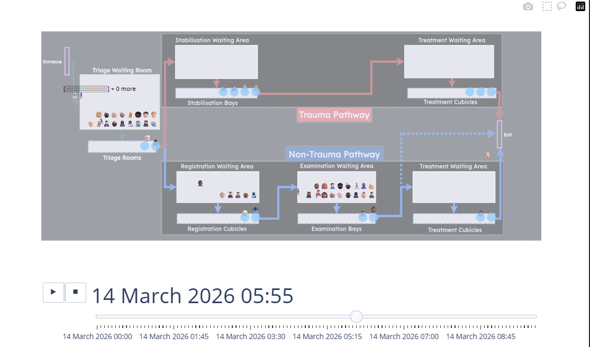

# How do we create animations?

::: {.fragment}

:::

## What is vidigi?

Vidigi is a package for creating animations of open-source discrete event simulations (like the ones you've been building in SimPy).

{.lightbox height=550}

## Who makes vidigi?

Us!

We've built it from the ground up with the intention of helping visualise health services.

So if anything isn't working, or if there is a feature you need that doesn't exist, the chances are we can sort that for you!

**You and your projects can help shape the package.**

## Extra Benefits of vidigi

::: {.focus-list}
- Works in common web application frameworks (which we'll introduce you to next week!)
- Also works in Quarto reports (which we'll introduce you to next module)
- Or can output as a standalone file
- Generates animations quickly enough to allow users to regenerate an animation after changing parameters
- Supports custom icons
:::
